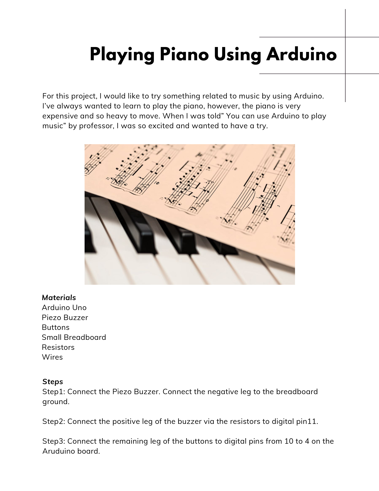
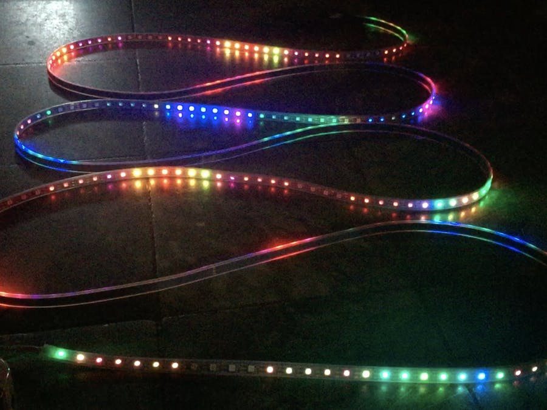

# Bilan Liu_CCA_Digital Electronics_SP20
Digital Electronics Homework&Exercise

# Week4-7-The Reactive Music LED Strip
Process Descritions:

## Video Link: 

## Things used in this project

Arduino UNO 
Sound Sensor

### Features

Sound reactive
Rechargeable
On/Off switch
Programmable

### input&output

input——Sound sensor

output——Led light，speaker

### Punch List

Must Have: 
-Sound sensor

-Speakers

-Distance sensor

-Led light

Nice to Have:

-According to the intensity the light can change to different colors

## Week 3
- For this project, I would like to try something related to music by using Arduino. I've always wanted to learn how to play the piano, however, the real instrument is expensive and heavy to move. When I was told "You can use Arduino to play music" by professor, I'm so excited and wanted to have to have a try.

## Week 2
- This is a Music Reactive LED strip, It was so cool that the strip can play the music and make it shine.
I'm interested in inserting music into my arduino project, so I'm concerned about how can I do this kind of project in the future.
The author used the Arduino Nano as the base. Used the FFT library to decode the sound into octaves, FASTLed library to drive the led strips, and an old iPhone C case to hold it all together.

  - See this link: https://create.arduino.cc/projecthub/buzzandy/music-reactive-led-strip-5645ed?ref=platform&ref_id=424_trending___&offset=88

## Week 1
- Processing Sketch: I made a Catcher Game, you can hover the mouse to get more apples and gained scores in limited time.

